# Exploratory Data Analysis — 30-Day Heart Failure Readmission

Generated by `notebooks/05_eda_detailed.ipynb` on the cleaned dataset
(`data/processed/cleaned.csv`, 3,000 patients × 15 variables after dropping
`patient_id`). The analysis is organized around the topics from **Chapters 1–5**.
All figures live in `figures/` and all tables in `tables/`.

> This is observational data, so the associations below describe **correlation,
> not causation** (Ch 1.3).

---

## 1. Variables and data types (Ch 1.1–1.3)

The response is `readmitted_30d` (binary). The 14 explanatory variables split into:

- **Quantitative (9):** age, bmi, bnp, sodium, creatinine, systolic_bp, heart_rate, adherence_score, distance_to_hospital_km
- **Categorical binary indicators (3):** ace_inhibitor, beta_blocker, diuretic
- **Categorical (2):** gender (binary), income_level (Low/Medium/High)

Full classification: `tables/tbl_variable_types.csv`.

## 2. Univariate descriptive statistics (Ch 1.4)

Center, spread, position, and shape for every numeric feature are in
`tables/tbl_numeric_summary.csv`.

- 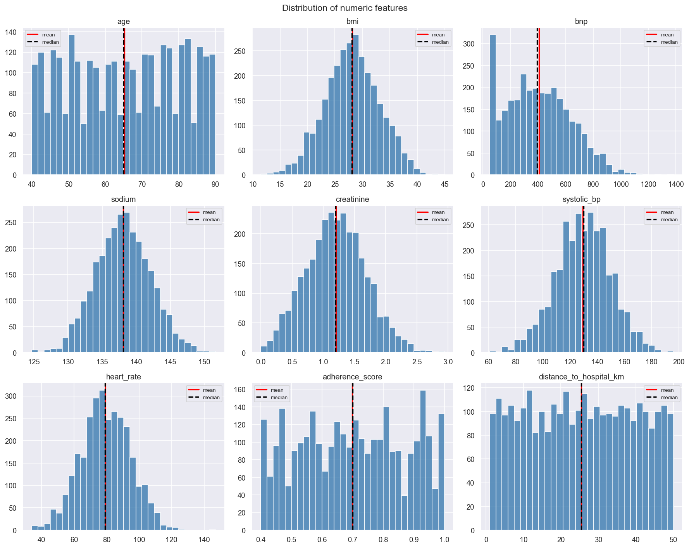 — mean (red) vs median (black) per feature.
- 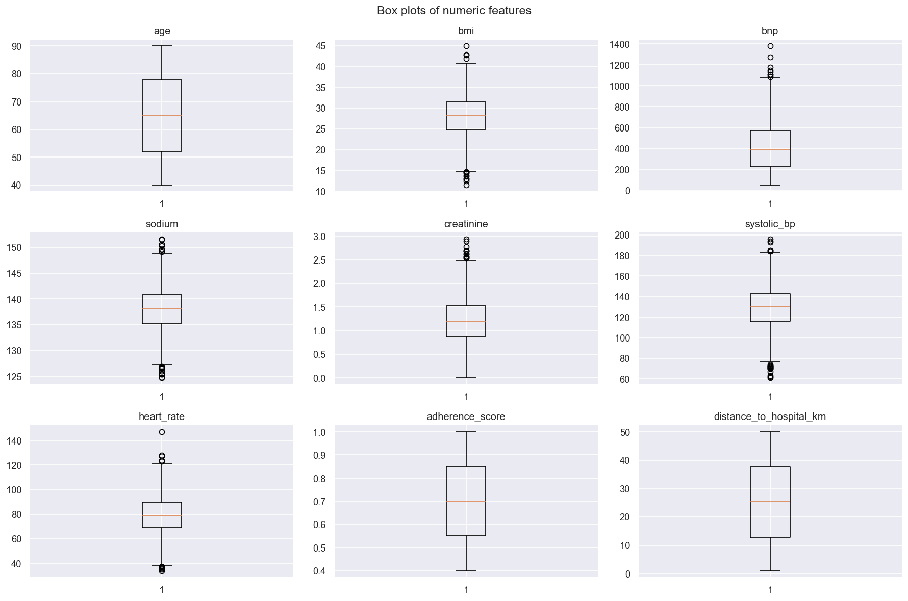 — position and 1.5·IQR outliers.
- 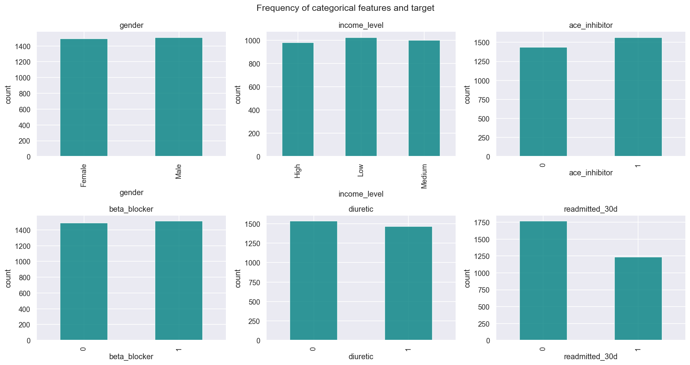

The target is **41.1% readmitted** (1,234 of 3,000) — balanced enough that
accuracy is meaningful alongside other metrics, but a majority-class baseline
still scores ~58.9%.

## 3. Probability distributions (Ch 2)

- **`sodium` ≈ normal** (skewness ≈ 0.0): 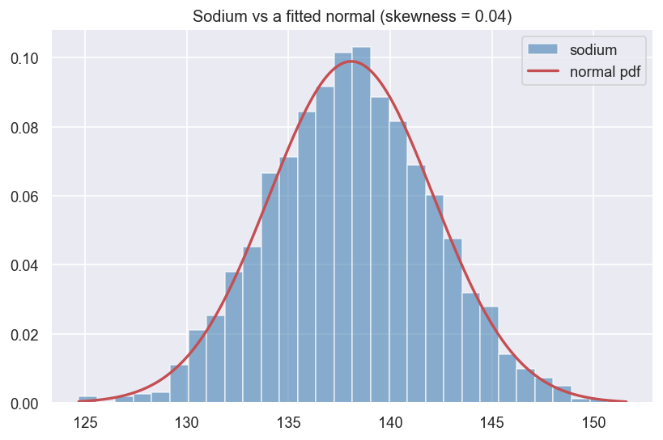
- **`bnp` is right-skewed** (skewness ≈ 0.35) and fits a **gamma** (method-of-moments):
  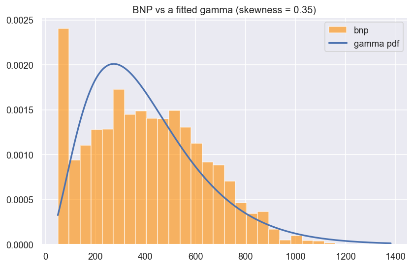
- **Empirical rule on `age`** (`tables/tbl_empirical_rule_age.csv`): only **57.5%**
  of ages fall within ±1 SD (normal theory: 68%), so `age` is **not** normal —
  it is closer to uniform across 40–90. A good reminder to check shape, not assume it.

## 4. Sampling distribution and the CLT (Ch 3)

Drawing 5,000 samples of n = 40 from the skewed `bnp`:

| quantity | value |
|---|---|
| population mean | 406.31 |
| mean of sample means | 406.11 |
| theoretical SE (σ/√n) | 36.73 |
| observed SD of sample means | 36.60 |

The sampling distribution of the mean is approximately normal even though the
underlying variable is skewed, and the observed spread matches σ/√n almost
exactly. 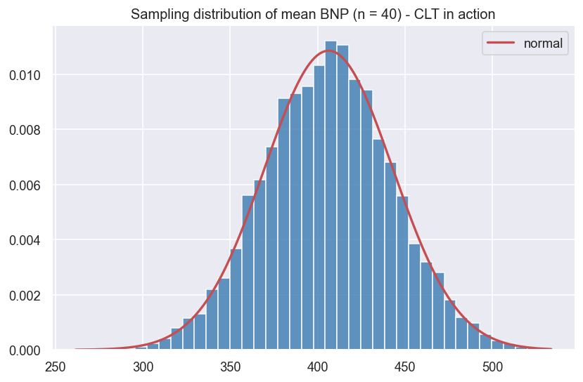

## 5. Estimation — confidence intervals (Ch 4)

- **t-based 95% CIs** for every numeric mean: `tables/tbl_mean_cis.csv`.
- **Readmission proportion:** 0.4113, 95% Wald CI **(0.3937, 0.4289)**.
- **Bootstrap vs t (mean BNP):** bootstrap **(397.8, 414.5)** ≈ t-based
  **(398.0, 414.6)** — the two approaches agree. 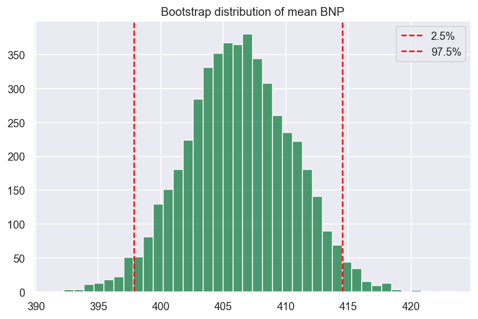
- **Bayesian (flat Beta(1,1) prior):** posterior mean 0.4114, 95% credible
  interval **(0.3938, 0.4290)** — essentially identical to the frequentist CI
  with this much data. 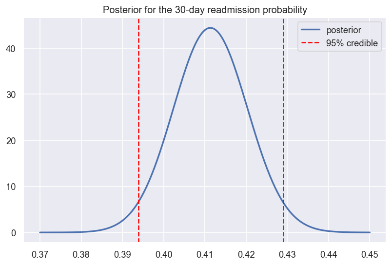

## 6. Bivariate analysis and significance testing (Ch 1.5, Ch 5)

- **Correlations** among numeric features are all weak (|r| < 0.05):
  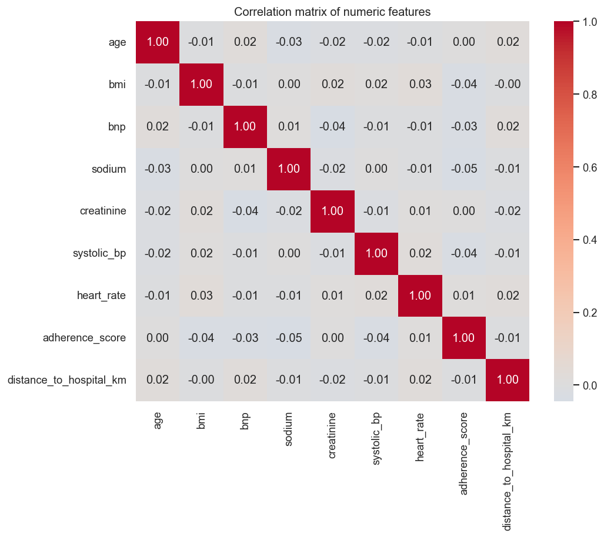 (`tables/tbl_correlations.csv`).
  No multicollinearity concerns.
- **Regression line**, adherence_score vs bnp: 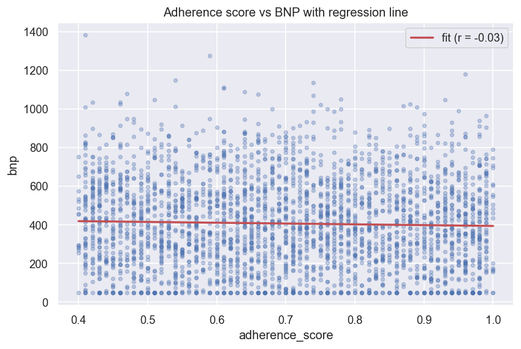
- **Numeric vs target** — Welch's t-test, Cohen's d, and 95% CI for the
  difference in means: `tables/tbl_numeric_vs_target.csv`.
  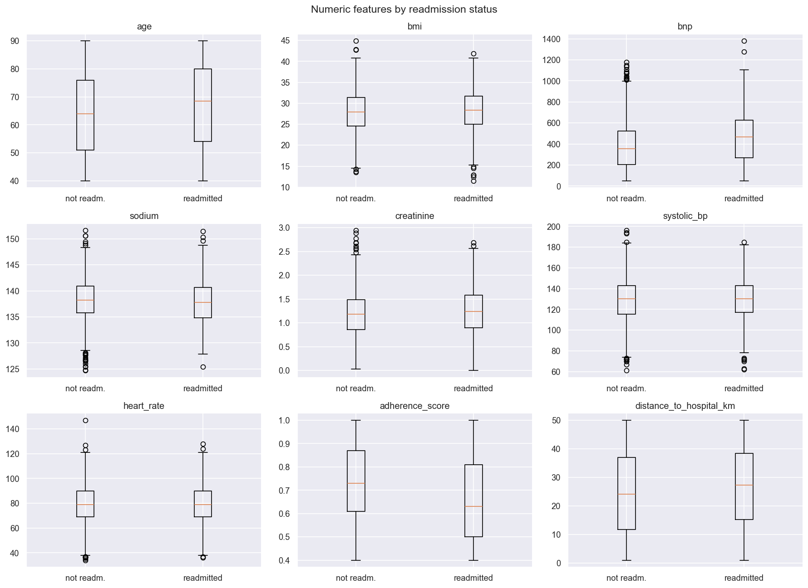
- **Categorical vs target** — chi-square and Cramér's V:
  `tables/tbl_categorical_vs_target.csv`. Standardized residuals for the
  ace_inhibitor association: `tables/tbl_std_residuals_ace.csv`.
- **Permutation test** (adherence_score, Ch 5.8): observed mean difference
  −0.068, permutation p ≈ 0.0000 — agrees with the t-test. 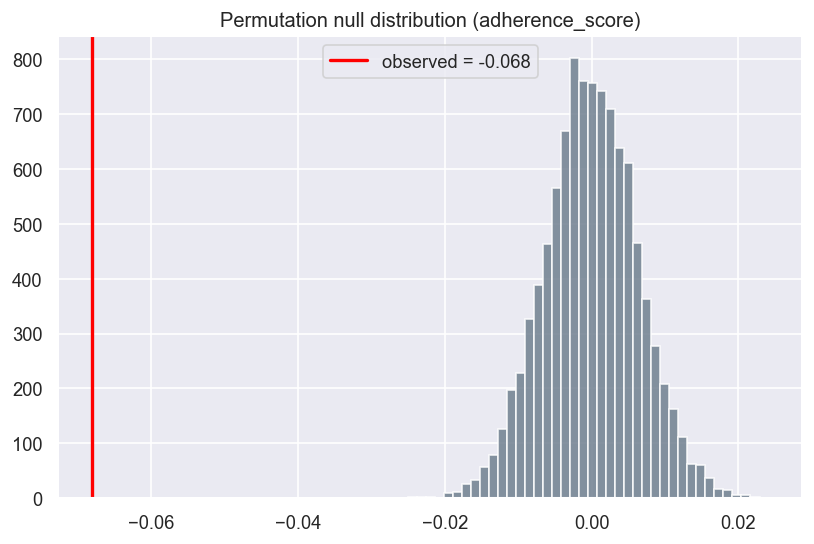
- **Power** (Ch 5.5): for the adherence_score comparison, Cohen's d = 0.40 and
  power ≈ 1.00 at α = 0.05 — the sample is large enough to detect this effect easily.

## 7. Summary of findings

Predictors ranked by effect size (`tables/tbl_eda_findings.csv`):

| feature | effect size | type | p-value | significant (0.05) |
|---|---|---|---|---|
| adherence_score | 0.40 | \|Cohen's d\| | <0.001 | yes |
| bnp | 0.33 | \|Cohen's d\| | <0.001 | yes |
| age | 0.19 | \|Cohen's d\| | <0.001 | yes |
| distance_to_hospital_km | 0.14 | \|Cohen's d\| | 0.0002 | yes |
| sodium | 0.10 | \|Cohen's d\| | 0.006 | yes |
| creatinine | 0.09 | \|Cohen's d\| | 0.014 | yes |
| ace_inhibitor | 0.09 | Cramér's V | <0.001 | yes |
| beta_blocker | 0.08 | Cramér's V | <0.001 | yes |
| systolic_bp | 0.07 | \|Cohen's d\| | 0.053 | no |
| bmi | 0.06 | \|Cohen's d\| | 0.142 | no |
| heart_rate | 0.02 | \|Cohen's d\| | 0.503 | no |
| diuretic | 0.02 | Cramér's V | 0.411 | no |
| income_level | 0.01 | Cramér's V | 0.798 | no |
| gender | 0.00 | Cramér's V | 0.987 | no |

**Takeaways**

- The strongest signals are **adherence_score** (lower adherence → more
  readmission) and **bnp** (higher → more readmission), followed by **age**,
  **ace_inhibitor**, **beta_blocker**, and **distance_to_hospital_km**.
- All effect sizes are **small-to-moderate** — even significant predictors
  explain little individually (Ch 5.6: statistical ≠ practical significance).
  This is consistent with the modest logistic-regression fit (pseudo-R² ≈ 0.08)
  in `04_modeling`.
- **gender** and **income_level** show no association with readmission.
